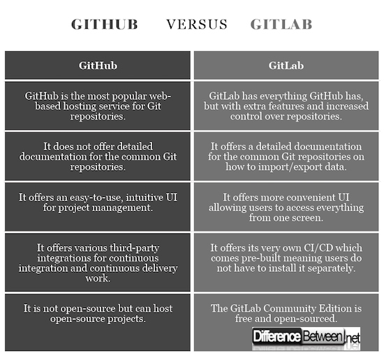

# Create and activate pythonvirtual environment

```
python3 -m virtualenv venv
source venv/bin/activate
```
To deactivate
```
deactivate
```

# Add `.gitignore` for clean version control

- Goto `gitignore.io` website and search for the stacks, programming lnguages, IDEs you will use. Here, `xcode`, `python`, `flask`
- Click on `create`
- copy the text in `gitignore.io` file and save it in main directory (or child directory). You can even restrict folders from being comitted / pushed to github by adding the path to the folder or file at the end of the file. *Note: The path must be mentioned relative to the location of `.gitignore` file. For example, i don't want to include `venv` virtual environment folder in my commits. As it is in the same directory as `.gitignore` file, at the eof, i will mention `venv` in new line.*

*There is `venv` in this repo because it was committed before `.gitignore` was added. Doesn'r matter as it won't be updated with every commit / push*

# Deployment

- For deployment we have to use CI CD Pipeline
- We will use `Flask`, `Docker` and `gitlab`


**1. Docker Installation**

*Note: If you are using windows, install ubuntu in virtual box and install docker in it. Docker is built for linux; Quite complicated in windows.*

- It is a PaaS product uses `OS-level virtualisation` to deliver softare packages called `containers`
- Install it to your linux (virtual) or Mac OS (refer official website. Easy steps.)
- check if it is running or not using `sudo docker run hello-world` (Internet connection required). You should see `Hello from Docker!`

**2. Jenkins Installation**

Jenkins is an open source Continous Integration platform - Crutial tool in DevOps Lifeycle.

- Don't install on top of docker. Install in host OS itself
- Written in java, so yo will require `jdk` to run it (download oracle jdk latest version from official website ). For MacOS, download `.dmg` file and install `.pkg` file that appears when clicked on it. check installation using `java --version`
- Install Jenkins latest version: `brew install jenkins-lts`
- Start jenkins service: `brew services start jenkins-lts`
- Restart jenkins service: `brew restart start jenkins-lts`
- After starting the Jenkins service, browse to `http://localhost:8080`
    - Install recommended plugins so that jenkins runs smoothly
    - Enter username or password that can be remembered easily. Eg. `admin`; `admin`
    - Youn will land on jenkins page. We will configure it when we will write our flask code and deploy it
    - Stop Jenkins: `brew services stop jenkins-lts`
    
    **3. GitLab Inastallation**
    
    - We are going to install `GitLab` on top of docker itself.
    - Run `docker images` to see availabe images
    - You can pull (download) any image you want from dockerhub using command `docker pull`. Just search it in hub.docker.com. (Use CE - Community Edition)
    
```
    docker pull gitlab/gitlab-ce
```
    - Run the `GitLab Image` using docker
    ```
    docker run -d -p 443:443 -p 80:80 -p 22:22 --name gitlab1 gitlab/gitlab-ce
    ```
        `-d` : Run in background
        `-p host-port:docker-image-port` : Port configuration. GitLab has `three ports` we need to open - `443`, `80` (UI runs here), `22` (For all 3 ports).
        `--name name-of-container name-of-image` : `Name-of-container` can be anything you want.
    
    - Check running containers:
    ```
    docker ps
    ```
    
    - Check history: List all containers (and the images it was based on) that were run previously
    ```
    docker ps -a
    ```
    
    - Stop the running container. You can find `<container-id>` from `docker ps` or `docker ps -a`
    ```
    docker stop <container-id>
    ```

    - Start a container. You can find `<container-id>` from `docker ps` or `docker ps -a`. If not found in both commands, run using pulled gitlab image usng `docker run -d -p . . . . `
    ```
    docker start <container-id>
    ```

    - See logs: `docker logs
    
    - After running the container or starting the container, goto `localhost:80` (where UI is hosted.) It may show error `502, Taking too long to respond`, but eventually it loads when you reload it or all by itself. Set simple 8 characters password like `adminadmin` and then register.
    

# Flask
